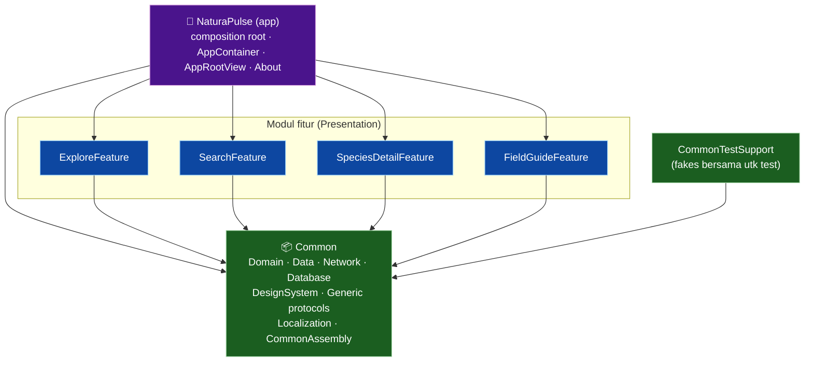

# Modularization — NaturaPulse

NaturaPulse dipecah menjadi **Swift Package Manager packages**. Modul basis bersama (`Common`) dipublish sebagai package terpisah dan dikonsumsi secara **remote** via SPM (`https://github.com/rfbnr/NaturaPulse-Common.git`, `from: "1.0.0"`); ia menyediakan seluruh Domain, Data, infrastruktur inti, design system, generic protocol, dan localization. Tiap fitur menjadi **local package** (di folder `Modules/`) yang hanya berisi lapisan Presentation dan bergantung ke `Common` remote. Aplikasi utama (`NaturaPulse`) adalah composition root yang merakit semuanya.

## Hubungan antar-modul



**Aturan dependensi (graf bintang):** setiap modul fitur **hanya** bergantung ke `Common`. Tidak ada dependensi antar-fitur. Aplikasi bergantung ke `Common` + keempat modul fitur, dan merupakan satu-satunya tempat implementasi konkret dirakit.

## Modul

| Modul | Jenis | Tanggung jawab | Bergantung ke |
|---|---|---|---|
| **Common** | Library (SPM) — *dipublish, dikonsumsi remote* | Entities, AppError, repository protocols, semua use case, semua Data (GBIF/Open-Meteo/Realm: DTO, data source, mapper, repository impl), Network (APIClient), Database (RealmProvider), DesignSystem (Colors/Typography/Spacing/Components/Motion), `LoadState`, `AppRoute`, generic protocols, localization, `CommonAssembly` | Alamofire, Swinject, RealmSwift, Kingfisher |
| **ExploreFeature** | Library (SPM) | `ExplorePresenter` + `ExploreView` (+ komponen) + `ExploreAssembly` | Common, Swinject |
| **SearchFeature** | Library (SPM) | `SearchPresenter` + `SearchView` + `SearchAssembly` | Common, Swinject |
| **SpeciesDetailFeature** | Library (SPM) | `SpeciesDetailPresenter` + `SpeciesDetailView` + factory + `SpeciesDetailViewProvider` + `SpeciesDetailAssembly` | Common, Swinject |
| **FieldGuideFeature** | Library (SPM) | `FieldGuidePresenter` + `FieldGuideView` + `FieldGuideAssembly` | Common, Swinject |
| **CommonTestSupport** | Library (SPM) | Fake repository + `Species.stub` bersama untuk test target | Common |
| **NaturaPulse** | App | Composition root (`AppContainer`), `AppRootView` (TabView), `AboutView`, `NaturaPulseApp` | Common + 4 modul fitur |

## Pendekatan generic protocol

`Common/Generic/` mendefinisikan kontrak generic berbasis `associatedtype` (`Common/Sources/Common/Generic/GenericProtocols.swift`):

```swift
public protocol UseCase {
    associatedtype Request
    associatedtype Response
    func execute(_ request: Request) -> AnyPublisher<Response, AppError>
}

public protocol Repository {
    associatedtype Request
    associatedtype Response
    func fetch(_ request: Request) -> AnyPublisher<Response, AppError>
}

public protocol RemoteSource { associatedtype Request; associatedtype Response; func execute(_ request: Request) -> AnyPublisher<Response, AppError> }

public protocol Mapper {
    associatedtype DTO
    associatedtype Domain
    func toDomain(_ dto: DTO) -> Domain
}

public struct Interactor<Request, Response, R: Repository>: UseCase
where R.Request == Request, R.Response == Response {
    public init(repository: R)
    public func execute(_ request: Request) -> AnyPublisher<Response, AppError>
}
```

Vertikal nyata yang membuktikan pola generic end-to-end ada di `Generic/NearbySpeciesGenericVertical.swift`: `NearbySpeciesRepository: Repository` + `Mapper` (DTO GBIF → `[Species]`) dijembatani `Interactor` menjadi sebuah `UseCase` — diuji di test target.

## Dependency inversion antar-modul

Agar modul fitur tidak saling bergantung, navigasi ke layar Detail memakai **abstraksi di Common**, bukan tipe konkret milik `SpeciesDetailFeature`:

```swift
// Common
public protocol SpeciesDetailViewProviding {
    @MainActor func makeDetailView(for species: Species) -> AnyView
}
```

`SpeciesDetailFeature` menyediakan implementasi konkret (`SpeciesDetailViewProvider`) yang didaftarkan di `SpeciesDetailAssembly`. List view Explore/Search/FieldGuide me-`resolve(SpeciesDetailViewProviding.self)` dari container — sehingga mereka **hanya** perlu `import Common`. Implementasi konkret dirakit di composition root (app). Inilah yang menjaga graf tetap berbentuk bintang.

## Dependency Injection lintas-modul

Swinject dipakai sebagai composition root. `CommonAssembly` (di `Common`) mendaftarkan seluruh infrastruktur bersama — `APIClient`, `RealmProvider`, semua data source, repository, dan use case. Tiap `*Assembly` fitur hanya mendaftarkan presenter/provider-nya. `AppContainer` merakit semuanya:

```swift
Assembler([
    CommonAssembly(),
    AppAssembly(),
    ExploreAssembly(),
    SearchAssembly(),
    SpeciesDetailAssembly(),
    FieldGuideAssembly()
])
```

## Localization

Modul `Common` memuat string ter-localize (`Common/Resources/{en,id}.lproj/Localizable.strings`) dan helper `public extension String { var localized: String { NSLocalizedString(self, bundle: .module, comment: "") } }` yang membaca dari `Bundle.module`. Karena string hidup di modul, semua fitur memakai kunci yang sama tanpa duplikasi.

## Menguji tiap modul

Tiap package punya test target sendiri. Fake repository bersama ada di produk `CommonTestSupport` sehingga test target fitur bisa memakainya kembali.

```bash
# Tiap fitur (jalankan dari dir modulnya)
cd Modules/ExploreFeature && xcodebuild test -scheme ExploreFeature -destination 'platform=iOS Simulator,name=iPhone 17 Pro'
# Aplikasi (merakit semua modul)
xcodebuild test -scheme NaturaPulse -destination 'platform=iOS Simulator,name=iPhone 17 Pro'
```

Modul `Common` dipublish sebagai package terpisah dan dikonsumsi secara remote via SPM (`https://github.com/rfbnr/NaturaPulse-Common.git`, `from: "1.0.0"`); test `Common` + `CommonTestSupport` berjalan di repo tersebut.
