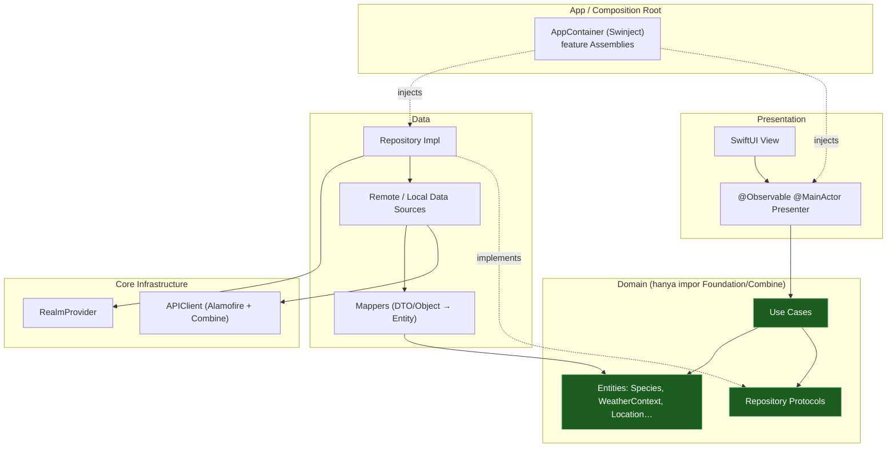
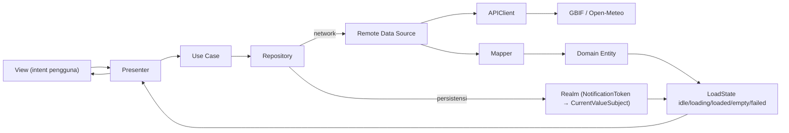

# NaturaPulse

**Panduan Mikro-Biodiversitas Personal** — aplikasi iOS berbasis lokasi yang menjawab satu pertanyaan: *“Spesies makhluk hidup apa yang mungkin tercatat di sekitar tempat ini?”*

NaturaPulse memadukan data okurensi biodiversitas (GBIF) dengan konteks lingkungan ringan (Open-Meteo). Anda menjelajah spesies yang tercatat di dekat sebuah lokasi, mencari katalog berdasarkan nama, membuka detail spesies beserta catatan lokal, menyimpan spesies ke Field Guide pribadi, dan membuka koleksi tersimpan secara offline. Data cuaca dan kualitas udara ditampilkan **sebagai konteks saja** — bukan klaim sebab-akibat terhadap perilaku spesies.

- **Platform:** iOS 26.5 · SwiftUI · Combine
- **Arsitektur:** Feature-First Clean Architecture (Presentation / Domain / Data) dengan composition root Swinject
- **Data:** GBIF (biodiversitas) · Open-Meteo (cuaca, kualitas udara, geocoding)
- **Persistensi:** Realm · **Gambar:** Kingfisher · **Networking:** Alamofire · **Lint:** SwiftLint

---

## Screenshots

> Ambil tangkapan layar di perangkat atau simulator, lalu letakkan gambarnya (mis. di `docs/screenshots/`).

| Explore | Search | Detail | Field Guide | About |
|---|---|---|---|---|
| _tambah gambar_ | _tambah gambar_ | _tambah gambar_ | _tambah gambar_ | _tambah gambar_ |

---

## Fitur

- **Explore** — spesies terdekat untuk lokasi saat ini atau lokasi pilihan, dengan cuplikan lingkungan (suhu, kelembapan, PM2.5). Kontrol radius, tarik-untuk-muat-ulang, *stale-while-loading*, serta state kosong/error yang rapi.
- **Search** — pencarian spesies reaktif: trim → panjang minimum → **debounce (300 ms)** → **hapus duplikat** → **batalkan request lama** (query terbaru yang menang).
- **Species Detail** — hero image, taksonomi, ringkasan catatan lokal, konteks lingkungan netral, deskripsi spesies *on-demand* (GBIF), atribusi sumber/gambar, dan tombol favorit.
- **Field Guide** — spesies tersimpan di Realm, dapat dibuka **offline**, reaktif terhadap perubahan, dengan geser-untuk-hapus.
- **About** — profil developer, misi, tech stack, dan atribusi data.
- **Polish** — shimmer skeleton, motion halus, haptics, serta pass aksesibilitas (Dynamic Type, VoiceOver, Reduced Motion, status tidak hanya mengandalkan warna).

Favorit dapat dilakukan dari kartu Explore/Search, Field Guide, maupun Detail — tidak perlu membuka Detail untuk menyimpan.

---

## Arsitektur

Feature-First Clean Architecture: setiap fitur memiliki layer `Presentation`, `Domain`, dan `Data`-nya sendiri. Aturan dependensi mengarah ke dalam — **Domain tidak bergantung pada apa pun** (hanya Foundation/Combine), Data mengimplementasikan kontrak Domain, Presentation mengonsumsi use case Domain, dan composition root aplikasi adalah satu-satunya tempat menyatukan tipe konkret.



**Aturan yang ditegakkan:** Domain tidak mengimpor SwiftUI/UIKit/Alamofire/Realm/Swinject/Kingfisher. Tidak ada DTO atau objek Realm yang bocor ke Presentation — data dipetakan ke entity value-type di batas Data. Antar-fitur tidak saling mengakses repository/data source; kebutuhan bersama ada di `Core`. Konkurensi: app target memakai default actor isolation `nonisolated` — Domain/Data thread-agnostic, Presenter eksplisit `@MainActor`.

### Alur data (Combine)



Pipeline Search memakai `debounce → removeDuplicates → switchToLatest` dengan `.catch` di dalam agar stream bertahan saat error, plus subject retry terpisah supaya retry menjalankan ulang query saat ini. Observasi Field Guide menjembatani `NotificationToken` Realm ke `CurrentValueSubject` (`collectionPublisher` pada build Realm yang terpakai tidak mengirim notifikasi secara andal).

---

## Tech Stack

| Kebutuhan | Pilihan | Versi |
|---|---|---|
| UI | SwiftUI | iOS 26.5 |
| Reactive | Combine | — |
| Networking | [Alamofire](https://github.com/Alamofire/Alamofire) | 5.12.0 |
| Dependency Injection | [Swinject](https://github.com/Swinject/Swinject) | 2.10.0 |
| Database lokal | [RealmSwift](https://github.com/realm/realm-swift) | 20.0.5 |
| Pemuatan/cache gambar | [Kingfisher](https://github.com/onevcat/Kingfisher) | 8.12.0 |
| Linting | [SwiftLint](https://github.com/realm/SwiftLint) | dev tool |
| Testing | XCTest | — |

Dependency dikelola dengan Swift Package Manager dan di-resolve otomatis oleh Xcode.

---

## Sumber API & Atribusi

**GBIF — Global Biodiversity Information Facility** (data utama)
- Spesies terdekat: `GET /v1/occurrence/search?geoDistance={lat},{lon},{r}km&mediaType=StillImage&limit=20`
- Cari berdasarkan nama: `GET /v1/occurrence/search?q={query}`
- Deskripsi spesies: `GET /v1/species/{speciesKey}/descriptions`
- Media okurensi bisa memiliki lisensi berbeda dari data okurensi, sehingga metadata pembuat/lisensi/sumber gambar dipertahankan dan ditampilkan di Detail.

**Open-Meteo** (konteks lingkungan — konteks saja, bukan sinyal biodiversitas)
- API forecast, kualitas udara (PM2.5), dan geocoding. Data berlisensi **CC BY 4.0** dan mensyaratkan atribusi.

Endpoint publik GBIF/Open-Meteo yang digunakan di sini tidak memerlukan API key.

---

## Struktur Proyek

```text
NaturaPulse/
├── App/                      # NaturaPulseApp, AppRootView, AppContainer (composition root)
├── Core/
│   ├── Domain/               # Entities, AppError, Repository protocols
│   ├── Network/              # APIClient (Alamofire+Combine), Endpoint, NetworkError
│   ├── Database/             # RealmProvider
│   ├── DesignSystem/         # Colors, Typography, Spacing, Components, Motion (shimmer/haptics)
│   └── DI/                   # Network/Database/App assemblies
└── Features/
    ├── Explore/              # Presentation / Domain / Data / DI
    ├── Search/
    ├── SpeciesDetail/
    ├── FieldGuide/
    └── About/
NaturaPulseTests/             # Test Domain, Data, Presentation, DI + Support doubles
```

Setiap folder fitur mengikuti pembagian yang sama: `Presentation / Domain / Data / DI`.

---

## Cara Menjalankan

1. **Kebutuhan:** Xcode 26+ (SDK iOS 26.5), macOS dengan simulator iOS 26.5 atau perangkat.
2. Clone repository dan buka `NaturaPulse.xcodeproj`.
3. Xcode akan me-resolve dependency Swift Package secara otomatis (Alamofire, Swinject, RealmSwift, Kingfisher). Tunggu proses “Package resolution” selesai.
4. Pilih skema **NaturaPulse** dan simulator iOS 26.5 (atau perangkat Anda), lalu **Run** (`⌘R`).

Izin lokasi bersifat opsional — jika ditolak, aplikasi jatuh ke lokasi default (Jakarta) dan pencarian lokasi manual via geocoding Open-Meteo.

---

## Testing

Jalankan semua test di Xcode dengan **`⌘U`**, atau dari terminal:

```bash
xcodebuild test -scheme NaturaPulse \
  -destination 'platform=iOS Simulator,name=iPhone 17 Pro'
```

- **113 metode XCTest di 31 file**, mencakup use case Domain, mapper/repository/data source Data, Presenter, dan assembly DI.
- Network diuji dengan stub `URLProtocol` (tanpa panggilan live); persistensi memakai Realm in-memory.
- Layer domain sepenuhnya dapat diuji tanpa UI atau network, sesuai persyaratan capstone.

---

## SwiftLint

SwiftLint (dipasang via Homebrew) menegakkan gaya penulisan; konfigurasi ada di `.swiftlint.yml`.

```bash
swiftlint lint --quiet
```

Proyek berjalan bersih pada level error.

---

## Batasan yang Diketahui

- **`collectionPublisher` Realm** tidak mengirim notifikasi secara andal pada build Realm yang terpakai, sehingga observasi Field Guide memakai jembatan `NotificationToken → CurrentValueSubject`.
- **Gambar cleartext:** sebagian URL media GBIF disajikan lewat `http`; mapper meng-upgrade-nya ke `https` secara best-effort. Host yang hanya melayani `http` jatuh ke ilustrasi placeholder (App Transport Security memblokir cleartext).
- **Offline-aware, bukan offline-first:** Field Guide bisa dibuka penuh secara offline, tetapi Explore/Search memerlukan koneksi jaringan.
- **Log DNS saat pertama jalan:** iOS bisa mencatat log jinak `nw_resolver … did not receive all answers in time` pada request GBIF pertama saat DNS diresolusi; request tetap berhasil dan tidak berulang.
- Paginasi sengaja dibatasi (ukuran halaman kecil) alih-alih infinite scroll.

---

## Lisensi

Dirilis di bawah **Lisensi MIT** — lihat berkas [LICENSE](LICENSE).

Data biodiversitas © kontributor GBIF; data lingkungan © Open-Meteo (CC BY 4.0).

---

*Dibuat sebagai proyek capstone iOS oleh Ridwan Febnur AR.*
